<div align="center">



<br/><br/>

<a href="https://www.awallet.life/"></a>
<a href="https://www.mycom.fit/"></a>
<a href="https://vorcl.net"></a>
<br/>
<a href="https://www.aion.work/"></a>
<a href="https://www.npmjs.com/package/agent-vorcl-flow"></a>
<a href="mailto:youareaviss@gmail.com"></a>

<br/><br/>



<br/><br/>



<br/><br/>



</div>

<br/>

## Products

| | | |
|---|---|---|
| **[Awallet](https://www.awallet.life/)** | A quiet AI personal-finance dashboard — wallets, budgets, savings goals, subscriptions, stocks, crypto and clear spending insights in one calm place. | `awallet.life` |
| **[PULSE](https://www.mycom.fit/)** | A private fitness operating system that connects training, recovery, nutrition and body signals into one adaptive plan. | `mycom.fit` |
| **[VORCL](https://vorcl.net)** | Applied-AI research and engineering — designing, training, integrating, testing and deploying production AI systems for real business processes. | `vorcl.net` |
| **[AION](https://www.aion.work/)** | A personal AI companion built to unite every important area of your life in one place. | `aion.work` |

## Open source

**[agent-vorcl-flow](https://github.com/Vitammiin/agent-vorcl-flow)** — an installable team of 20+ specialized AI sub-agents, skills, slash-commands and MCP tools for Claude Code, GPT Codex, Cursor and Kimi CLI. One command, no cloud backend — your coding agent runs everything locally.

```bash
npx agent-vorcl-flow
```

## How I work

```text
clarify the goal → split into atomic steps → route each step to a specialist agent
                 → verify with real output → ship
```

Root cause before symptom. Isolated git worktrees over shared working directories.
And no "done" without proof — a test run, a `git status`, a screenshot or a live endpoint.

<div align="center">
<br/>
<sub><b>Open to collaborations on applied-AI products, agent infrastructure and fintech.</b></sub><br/>
<sub><a href="mailto:youareaviss@gmail.com">youareaviss@gmail.com</a> &nbsp;·&nbsp; <a href="https://vorcl.net">vorcl.net</a></sub>
</div>

<!-- profile -->
